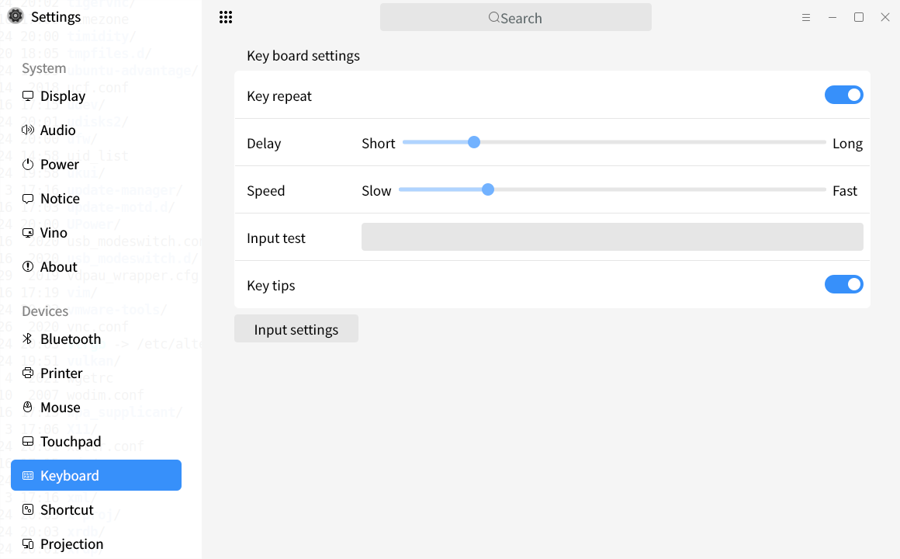
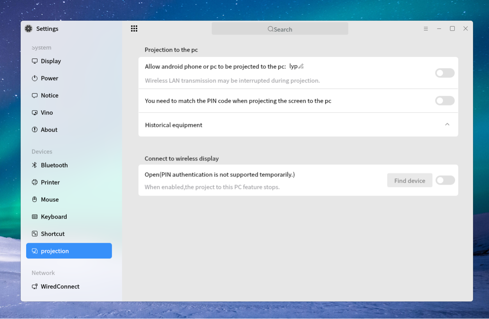
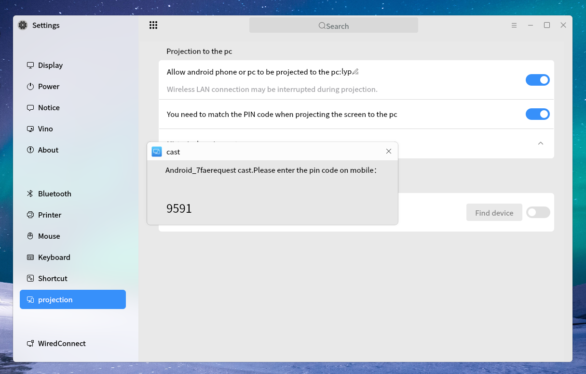
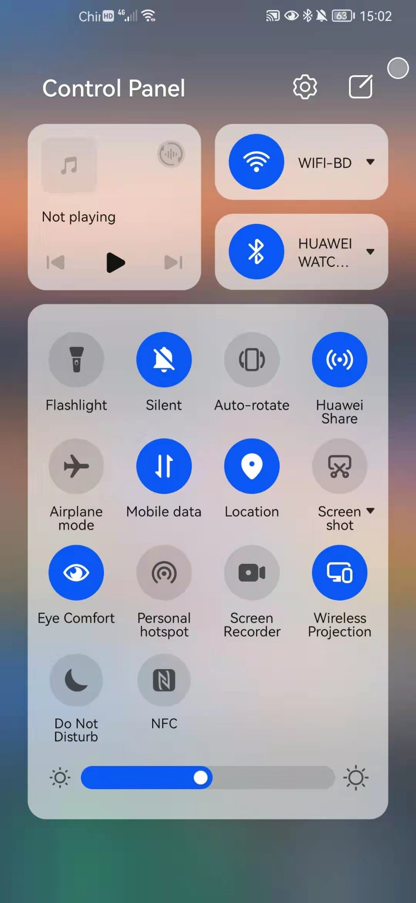
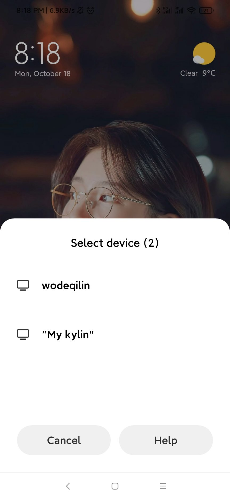
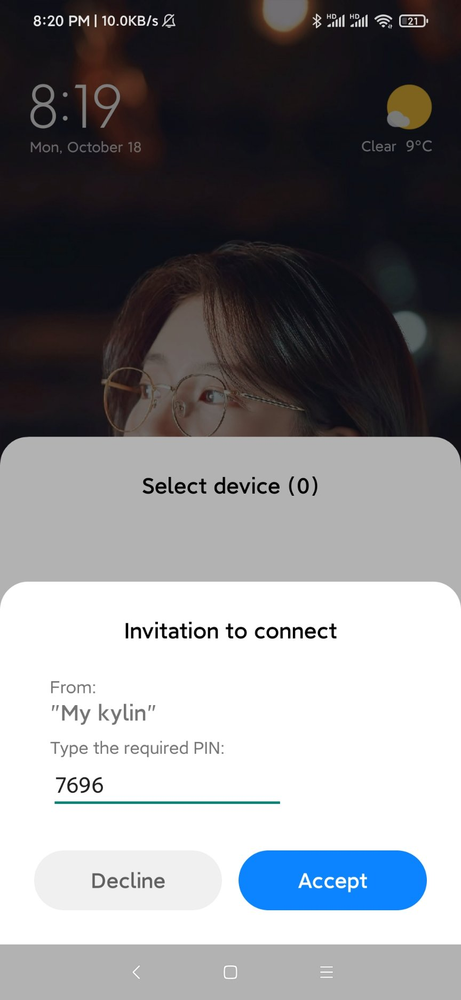
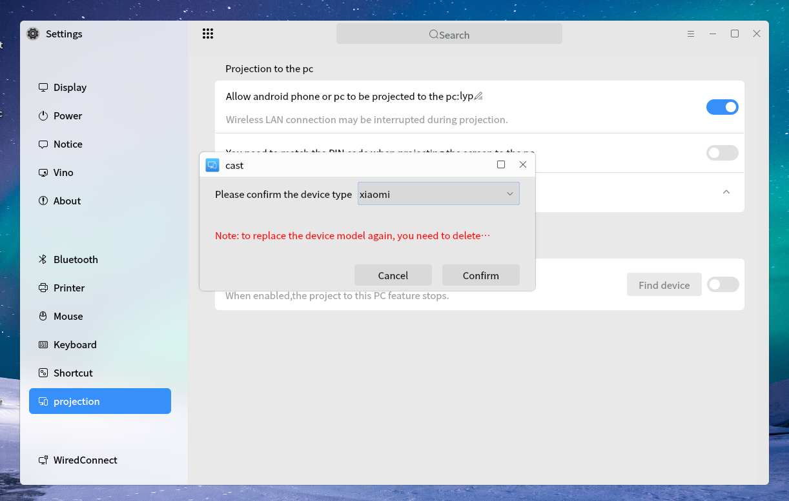
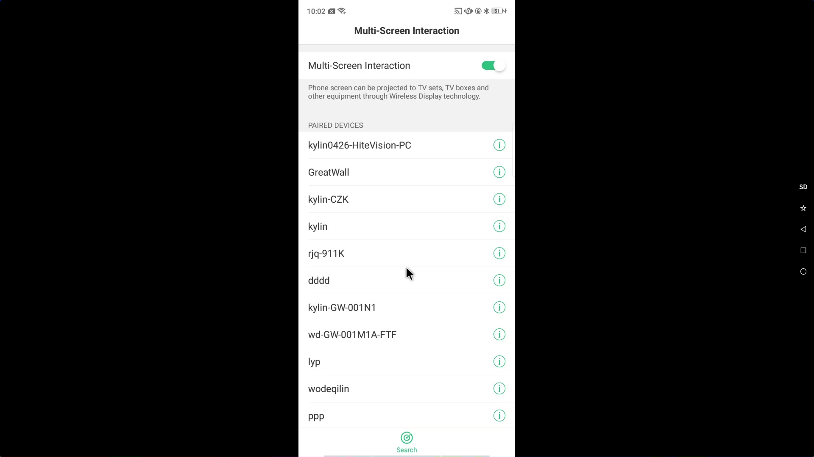
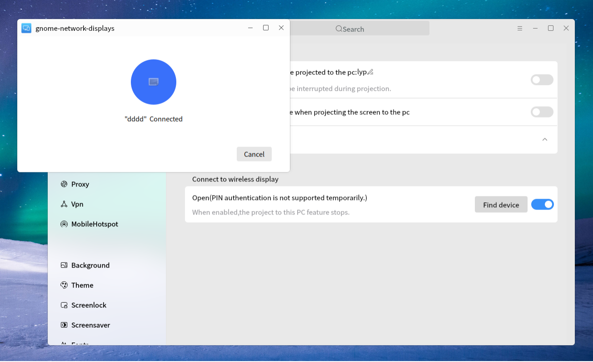
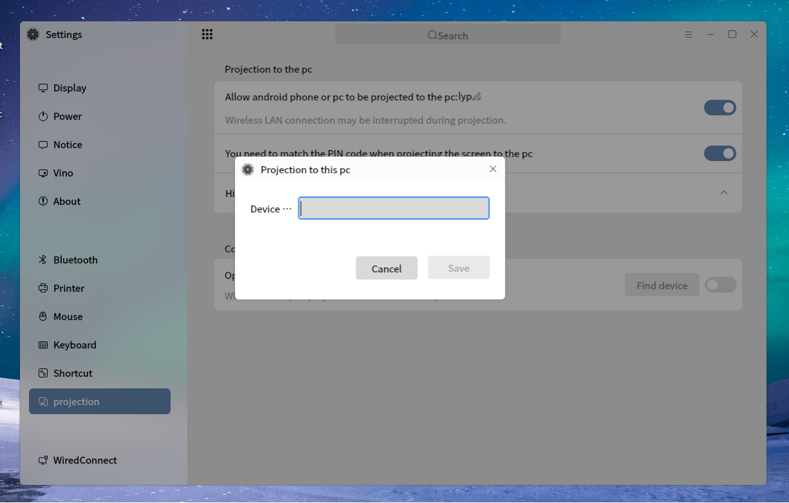

# Ukui Control Center
## Overview
Ukui Control Center provides a friendly graphic interface to set the system. As shown in Fig 1.

 

## System
### Display
As shown in Fig 2.

- monitor：Select current monitor.

- resolution, orientation, refresh rate, screen zoom are all for the current active monitor.

- screen zoom to global zoom.

- night mode has the functions of adjusting color temperature and customizing the night mode time period.

### Audio
As shown in Fig 3.

### Power
As shown in Fig 4.

### Notice
As shown in Fig 5.

### Vino
As shown in Fig 6.

### About
As shown in Fig 4.

 

## Devices
### Bluetooth
Provide the functions like those: open the bluetooth, rename the device, show/hide the icon of the bluetooth, find the nearby devices, etc.. As shown in Fig 8.

### Printer
Provide an entry to add printers or scanners. 

### Mouse
As shown in Fig mouse.

### Touchpad
As shown in Fig touchpad.

### Keyboard
As shown in Fig keyboard.

### Shortcut
As shown in Fig 13.

### Projection
Projection is a software that is allowed to be projected by mobile phones and other Kylin-OS and can be projected to other Kylin OS in Kylin OS desktop environment. It is divided into two parts: receiving terminal and sending terminal. The main interface is shown in Figure.

 

 The function buttons at the receiving terminal are in the upper part of the main interface, from top to bottom:

1) Receiving terminal on / off button: after the button is turned on, the current Kylin-OS device can be searched by mobile phone device or other Kylin-OS devices.

2) PIN code function on / off button: after the button is turned on, the PIN code needs to be entered during connection.

 

 

3) Historical device show / hide button: when the button arrow points down, you can see the relevant devices connected to the current Kylin-OS device.

 

The function buttons at the sending terminal are in the lower part of the main interface, including: 

Receiving terminal on / off button: this button is mutually exclusive with the sending terminal on / off button. When the receiving terminal on / off button is turned on, the receiving terminal on / off button needs to be turned off before the sending terminal on / off button can be turned on (the same is true for the receiving terminal turn on / off button). After opening this button, click Find device to pop up the search window, in which the searchable Kylin-OS device at the receiving terminal will be displayed.

 Connection process between mobile phone and Kylin-OS:

1) Open the receiving terminal on / off button (close the sending terminal on / off button first).

2) The mobile phone drop-down menu opens the projection (or mobile phone projection / multi screen collaboration).

 

3) Select the Kylin-OS device to be projected in the mobile search device list.

 

4) Connect (there are two types: PIN code required and PIN code not required).

5) Select the mobile phone model (currently divided into Huawei, Xiaomi and others).

 

6) Projection interface: the mobile phone screen is displayed in the center of the interface. There are 5 buttons on the right side of the interface, from top to bottom: soft / hard decoding switching button; Full screen / window switching button; Return to parent directory button; Return to the main interface button; Display the application process button;

 

Kylin-OS and Kylin-OS connection process:

1) Open the on / off button at the sending terminal (close the on / off button at the receiving terminal in advance).

2) Click the search device on the left side of the switch button;

 

3) In the pop-up search window, select the Kylin-OS device to project to.

 

4) Projection interface.

 

**FAQ**

1. If the projection is unsuccessful, you can try to connect again, and the device connected once will be automatically recorded in the history device.

2. Kylin OS and some phones support the control return function (that is, the receiving terminal can indirectly affect the sending terminal by operating the mouse or keyboard).

3. At present only some Huawei phones and Xiaomi phones support Android three button function (the last three buttons on the interface on the right side of the screen). For other models, clicking these buttons may cause unknown problems.

4. The system will use soft decoding by default. At this time, you can manually switch to hard decoding (use hardware to decode video, reduce CPU occupation, and need hardware support).

5. The name of the receiving device can be changed in the screen projection interface. Click the "pen" icon on the right side of the projection screen to enter the modification interface.

6. When the wireless network card is not inserted, or the wireless network card does not support the connection required for projection, it is necessary to insert the network card or replace the inserted network card.

7. When the package with wireless projection is not installed or the package version is too low, the projection function will not be displayed in the control panel.

8.When used as the sending terminal, it does not support projecting to the receiving terminal of SP1 version.

 

## Network
### WiredConnect
As shown in Fig 15.

### WlanConnect
As shown in Fig 16.

### Proxy
As shown in Fig 17.

### Vpn
As shown in Fig 18.

### MobileHotspot
As shown in Fig 19.

 

## Personalized
### Background
As shown in Fig 20.

### Theme
- Theme Mode:

- Icon theme and cursor theme:

- Effect settings (some machines do not support this function):

### Screenlock
As shown in Fig 22.

### Screensaver
As shown in Fig 23.

### Fonts
As shown in Fig 24.

 

## Account
### User Info

#### Current User
- Change User Face: Click user's face can change it.

- Change Password: Click "Password" to modify the current user's password.

- Change Account Type: administrator -- can elevated permission temporarily; standard user -- can't elevated permission.

#### Other Users
Administrator can modify other user's information, add new user, etc..

- Add new user

-Password complexity requirements(Password strength can be customized through security neutrality):

1. The user password cannot contain illegal characters ("'" and non-standard characters);

2. The minimum password length is 8;

3. The password shall contain at least two types of characters;

4. The password must not contain the user name;

5. It is forbidden to use palindrome in password;

6. Enable password similarity check (detect when modifying password);

7. Enable password dictionary;

8. The validity period of the password is unlimited;

### Biometrics
As shown in Fig 26.

### Cloud Account
Synchronize personalized settings and data, and this function needs to sign in.

#### Sign In
Login through Kylin ID login Center.

#### Synchronizable Items
- Desktop wallpaper

- Screensaver: wallpaper and idle time

- Fonts

- User's face

- The settings in control center, such as start menu, taskbar, theme, etc.

- The settings of pluma, kylin weather, peony, terminal, kylin video.

#### Tips
1) When opening the cloud account first time, it will synchronize once by default. If the cloud exists configuration files, it will download them and sync to local; Otherwise, the local configuration files will be uploaded to the cloud.

2) After login, if the automatic synchronization is opened, the cloud will synchronize the local configurations every 5 minutes. And they can be used by different machines, different users.

3) If the automatic synchronization is closed, all the cloud configurations will keep the last upload status.

4) The automatic synchronization for the single item is the similar effects.

 

## Datetime
### Date
As shown in Fig 28:

### Area
As shown in Fig 29:

 

## Update Operation

In update configuration, you can configure backup and update.

-Click start backup to automatically open our Kirin backup and restore tool for system content backup.
-Click Detect update to automatically open our Kirin update manager to obtain the updated content.

 

## Security
### Security Center
As shown in Fig 32.

 

## Application
### Auto Boot 
As shown in Fig 33:

### Default App
As shown in Fig 34:

## Investigation

### Search
As shown in Fig 35:

