# Ukui Control Center
## Overview
Ukui Control Center provides a friendly graphic interface to set the system. As shown in Fig 1.

 

## System
### Display
As shown in Fig 2.

- monitor：Select current monitor.

- resolution, orientation, refresh rate, screen zoom are all for the current active monitor.

- screen zoom to global zoom.

- night mode has the functions of adjusting color temperature and customizing the night mode time period.

### Audio
As shown in Fig 3.

### Power
As shown in Fig 4.

### Notice
As shown in Fig 5.

### Vino
As shown in Fig 6.

### About
As shown in Fig 4.

 

## Devices
### Bluetooth
Provide the functions like those: open the bluetooth, rename the device, show/hide the icon of the bluetooth, find the nearby devices, etc.. As shown in Fig 8.

### Printer
Provide an entry to add printers or scanners. 

### Mouse
As shown in Fig 10.

### Touchpad
As shown in Fig 11.

### Keyboard
As shown in Fig 12.

### Shortcut
As shown in Fig 13.

### Projection
 Projection provides the function of mirroring Android phones on KylinOS, and supports the control of return to facilitate the operation of mobile phones on the computer through the mouse and keyboard (supported by some mobile phones).

 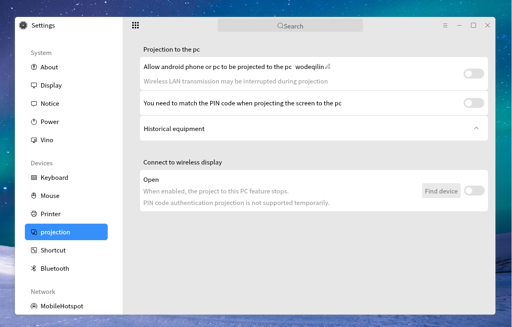

 To use the projection function, you first need to turn on the projection switch.

 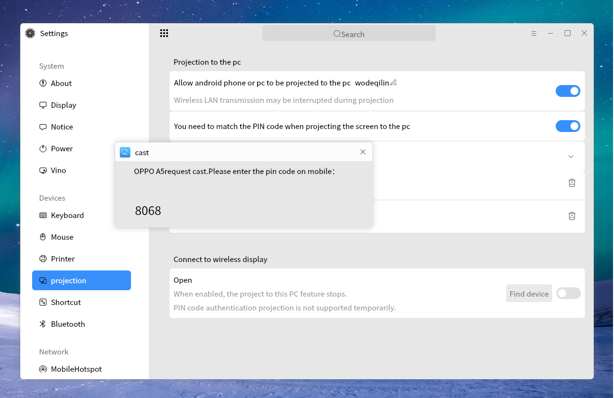

 Select projection / wireless projection / mobile projection and other identification interfaces in the mobile phone drop-down menu (take Huawei mobile phone mate as an example).

 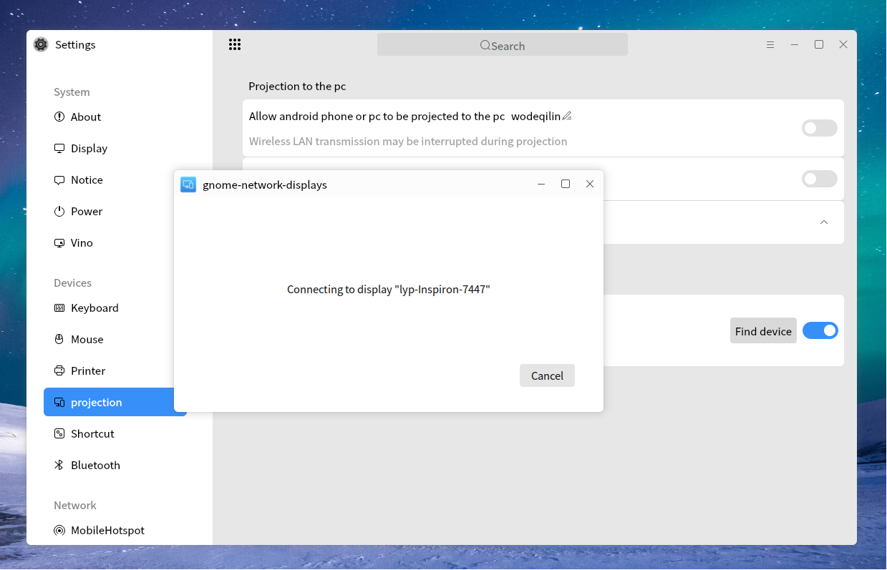

 Next, the mobile phone will automatically search and display the searched receiving device.

 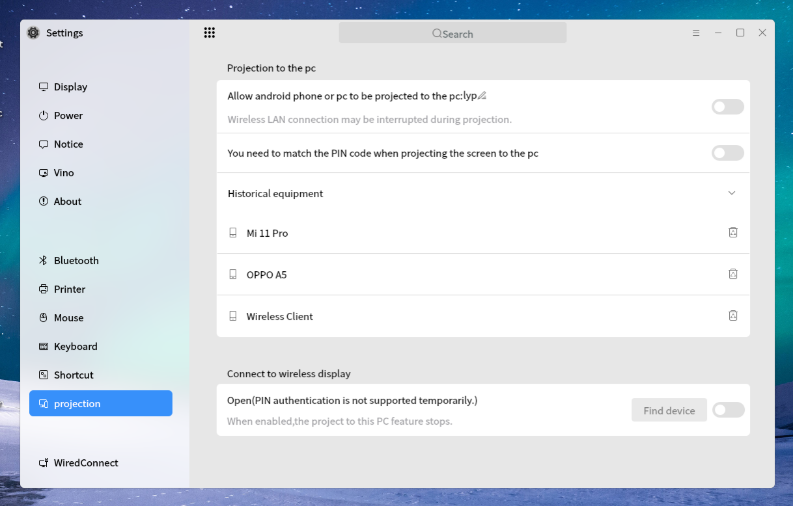

 Select your current KylinOS receiver device, such as my Kylin, etc.

 

 Whether to allow projection will be displayed on the KylinOS receiving terminal, click allow.

 

 According to the pin code displayed at the KylinOS receiving terminal, enter the pin code at the mobile terminal and click connect.

 

 Next, the connection interface will be displayed at the KylinOS receiving terminal and projection terminal.

 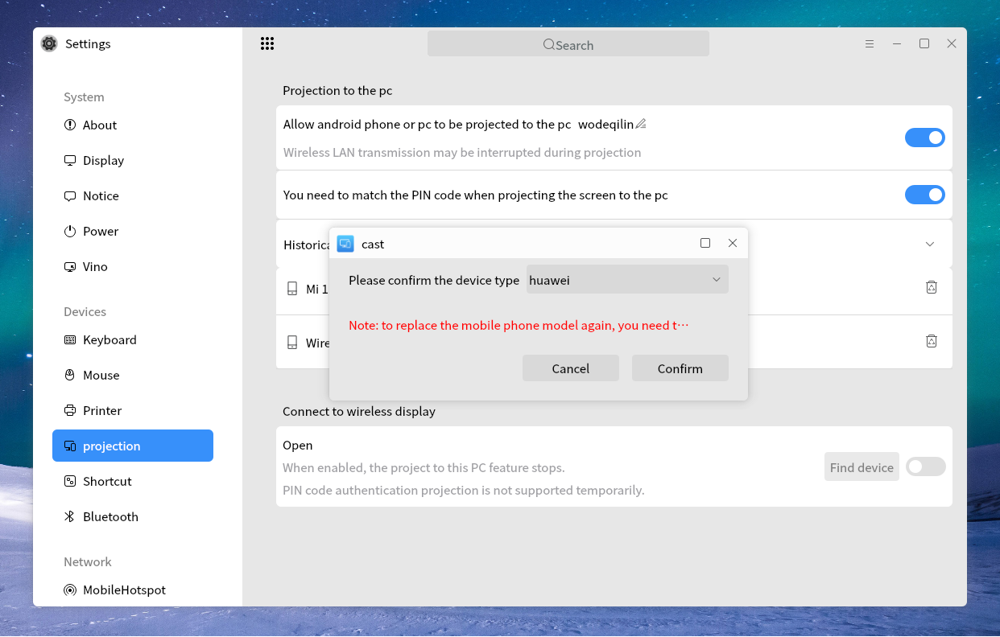
 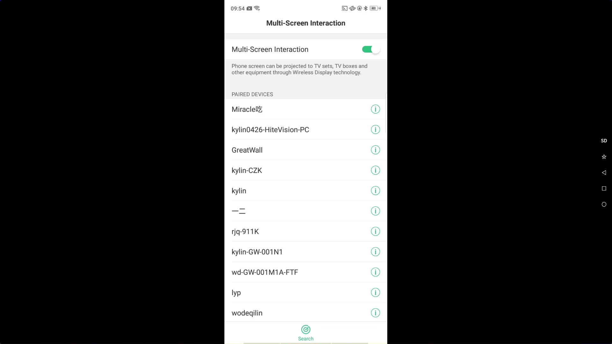

 If the connection is successful, the screen of the mobile phone will be synchronously mirrored at the receiving terminal. Double click the screen to exit the full screen.

 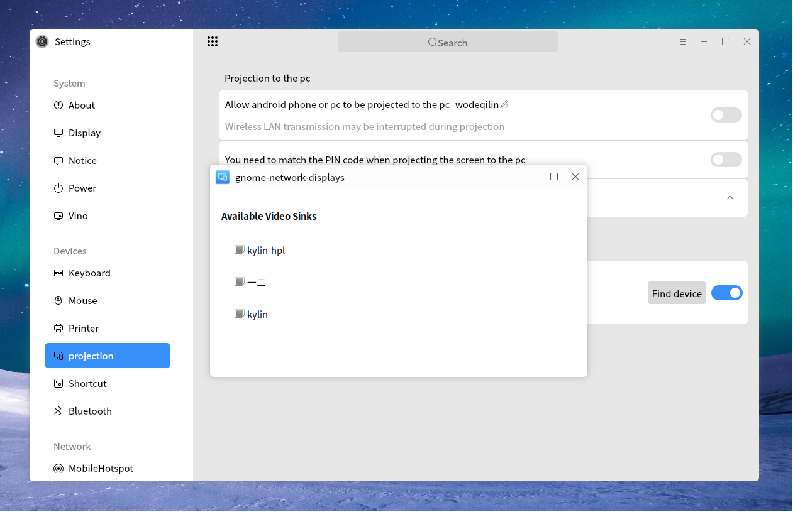
 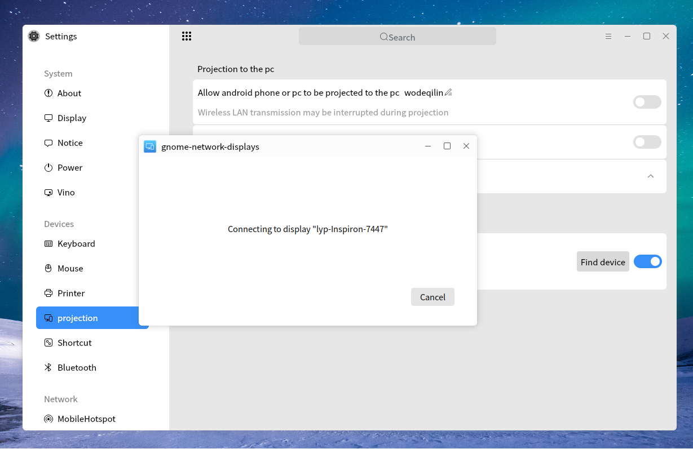

 To close the projection screen, double-click the screen to enter windowing, click "X" in the upper right corner to close it, or set the projection screen to gray (close) in the mobile phone drop-down menu to exit the wireless projection screen.

**FAQ**

1. If the screen is not successfully displayed, you can try to connect again. Usually, the mobile phone can be trusted after one connection. There is no need to enter the pin code for the next connection (also depends on the mobile phone design. Some mobile phones support credit without authentication connection).

2. The name of the receiving device can be changed in the screen projection interface. Click the "pen" icon on the right side of the projection screen to enter the modification interface.

3. When the wireless network card is not inserted, or the wireless network card does not support the connection required for projection, it is necessary to insert the network card or replace the inserted network card.

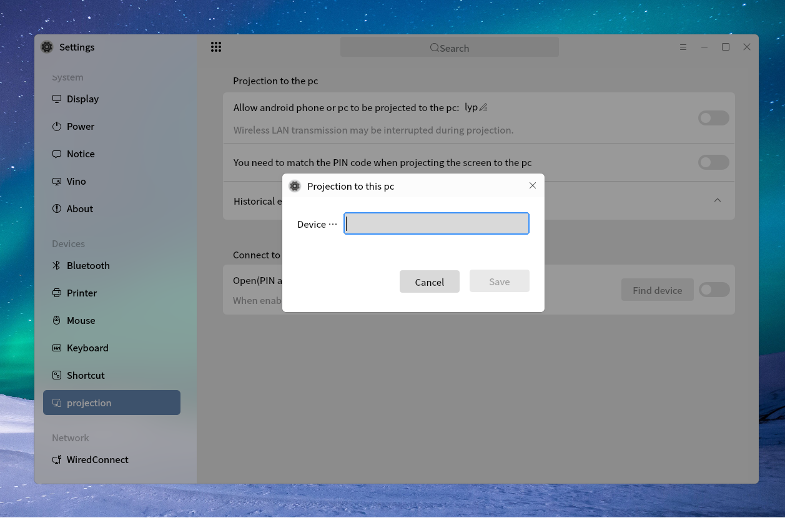

4. When the background service is abnormal, the following prompt will appear. You can try to restart the system to solve this problem.

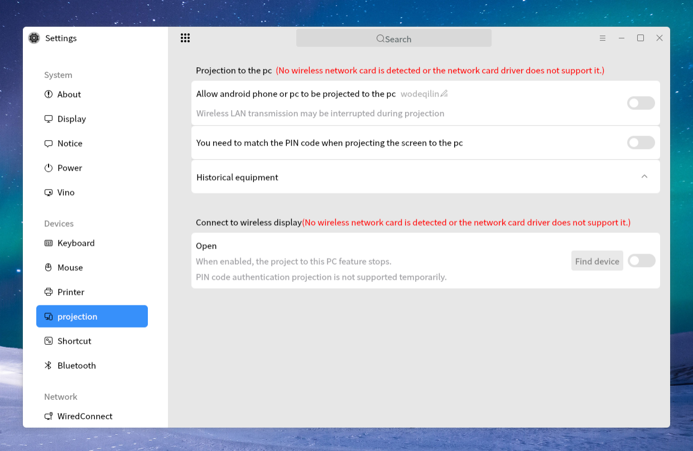

5. When the package with wireless projection is not installed or the package version is too low, the projection function will not be displayed in the control panel.

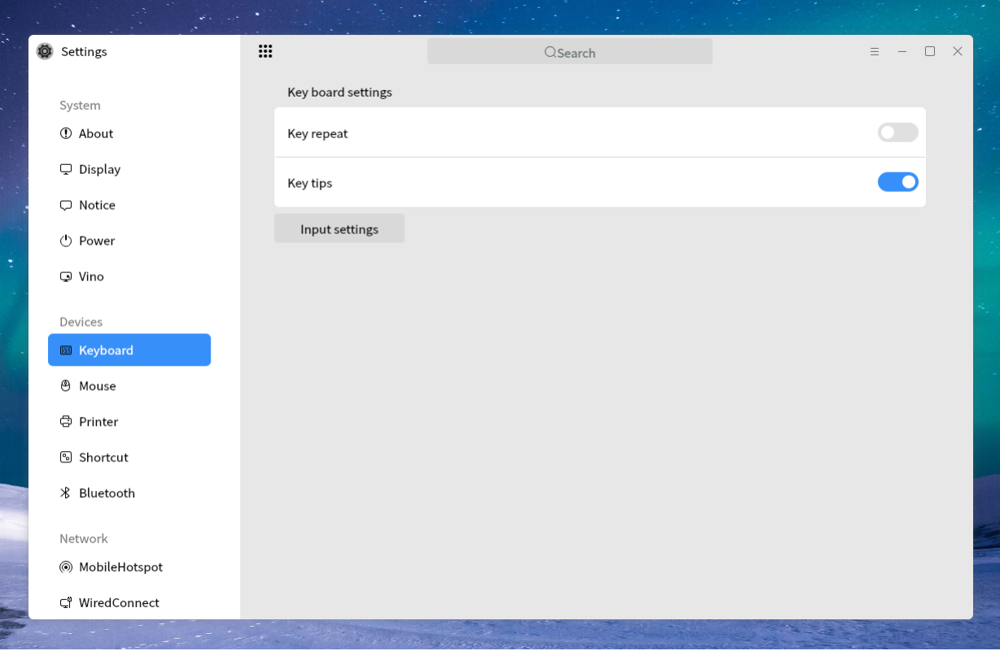

 

## Network
### WiredConnect
As shown in Fig 15.

### WlanConnect
As shown in Fig 16.

### Proxy
As shown in Fig 17.

### Vpn
As shown in Fig 18.

### MobileHotspot
As shown in Fig 19.

 

## Personalized
### Background
As shown in Fig 20.

### Theme
- Theme Mode:

- Icon theme and cursor theme:

- Effect settings (some machines do not support this function):

### Screenlock
As shown in Fig 22.

### Screensaver
As shown in Fig 23.

### Fonts
As shown in Fig 24.

 

## Account
### User Info

#### Current User
- Change User Face: Click user's face can change it.

- Change Password: Click "Password" to modify the current user's password.

- Change Account Type: administrator -- can elevated permission temporarily; standard user -- can't elevated permission.

#### Other Users
Administrator can modify other user's information, add new user, etc..

- Add new user

### Biometrics
As shown in Fig 26.

### Cloud Account
Synchronize personalized settings and data, and this function needs to sign in.

#### Sign In
Login through Kylin ID login Center.

#### Synchronizable Items
- Desktop wallpaper

- Screensaver: wallpaper and idle time

- Fonts

- User's face

- The settings in control center, such as start menu, taskbar, theme, etc.

- The settings of pluma, kylin weather, peony, terminal, kylin video.

#### Tips
1) When opening the cloud account first time, it will synchronize once by default. If the cloud exists configuration files, it will download them and sync to local; Otherwise, the local configuration files will be uploaded to the cloud.

2) After login, if the automatic synchronization is opened, the cloud will synchronize the local configurations every 5 minutes. And they can be used by different machines, different users.

3) If the automatic synchronization is closed, all the cloud configurations will keep the last upload status.

4) The automatic synchronization for the single item is the similar effects.

 

## Datetime
### Date
As shown in Fig 28:

### Area
As shown in Fig 29:

 

## Update
### Upgrade
Check whether the system has available updates.

- Update: Show the current update status and the time of the latest refresh.

- Update List: Push system available updates.

- Update Settings: Whether allow to renewable notice and backup before updating.

### Backup
- Begin backup: Back up files to other devices.

- Begin restore: View backup list and restore the system to one of them.

 

## Security
### Security Center
As shown in Fig 32.

 

## Application
### Auto Boot 
As shown in Fig 33:

### Default App
As shown in Fig 34:

## Search

### Search
As shown in Fig 35:

