# 设置
## 概 述
设置提供了一个友好的图形用户界面，用于对操作系统常用配置项进行管理。主界面如图所示。

 

## 系 统
系统配置设置提供了显示器、触摸屏、默认应用、电源、开机启动五个模块。

### 显示器
显示器可以配置显示相关的设置，上方彩色矩形代表当前屏幕，中间显示了显示器名称及接口名，如图所示。

- 显示器：选择当前显示器

- 分辨率、方向、刷新率、缩放屏幕的修改都是针对当前活动显示器

- 屏幕缩放为全局缩放

- 夜间模式具有调整色温度、夜间模式自定义时间段打开/关闭

### 触摸屏
触摸屏可以进行触摸相关的设置，在触摸点位置偏移时校准触点或调整触摸映射，如图所示。

- 显示器：选择要映射到的显示器

- 触摸屏标识：选择要映射或校准的触摸屏

- 触摸设备：所选触摸屏名称

- 点击触摸映射按钮，将选定的触摸屏映射到指定显示器

- 点击触摸校准按钮，启动工具对选定触摸屏进行校准

### 默认应用
默认应用可以修改图中几种类型的默认打开应用：

### 电 源
- 提供通用选项用来进行基本设置

- 当机器存在电池时，可进行电池节能计划的设置

- 电源计划中，提供了平衡和节能两种模式用来设置

### 开机启动
列表中显示当前系统已存在的开机启动软件。

点击“添加自启动程序”，可添加开机启动应用。

1）填写“程序名”；

2）填写“程序路径”，或者通过点击“浏览”按钮，在弹出的文件选择界面，选择以desktop为后缀的文件；

3）“程序描述”作为可选项，可填可不填；

4）点击“确定”按钮，新的启动项被创建并显示在列表中。

 

## 设 备
设备设置提供了打印机、投屏、触摸板、鼠标、键盘、快捷键、声音六个设置模块。

### 打印机
打印机功能提供了打印机程序入口

### 投 屏
无线投屏提供了在KylinOS上镜像安卓手机的功能，支持控制回传以方便在电脑端通过鼠标和键盘对手机端进行操作等行为（部分手机支持）

要使用无线投屏功能，首先需要开启投屏开关
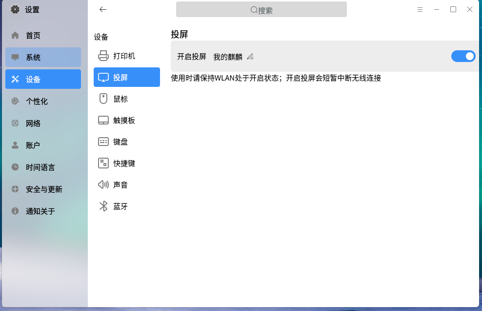

在手机下拉菜单中选择 投屏/无线投屏/手机投屏 等标识界面（以华为手机Mate为例）
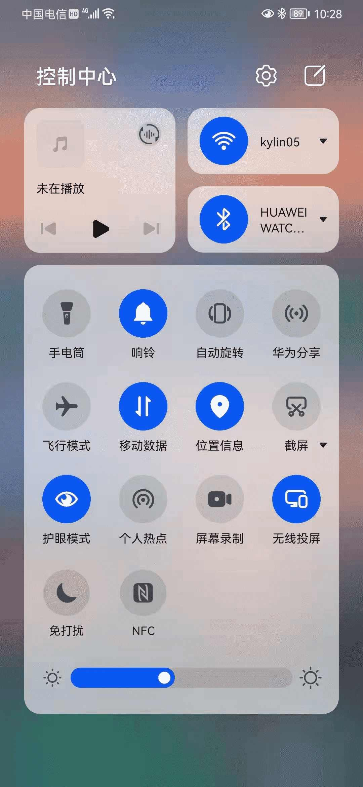

接下来手机上会自动搜索并且显示搜索到的接收端设备

选择您当前KylinOS接收端的设备，如 我的麒麟 等

在KylinOS接收端上会显示是否允许投屏，点击允许
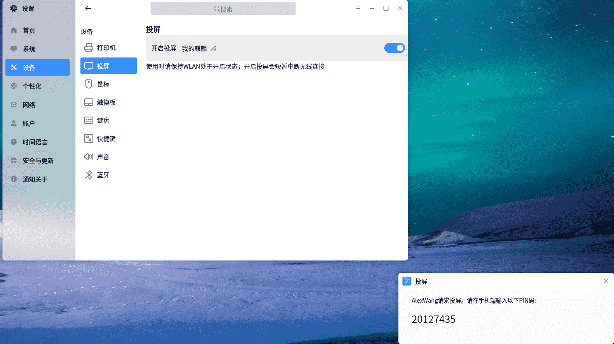

根据KylinOS接收端显示出的PIN码 在手机端输入PIN码 并点击连接
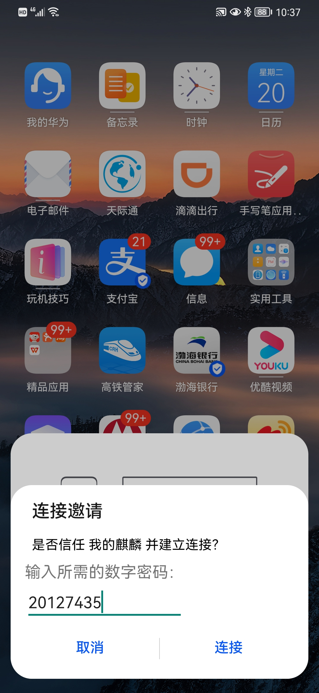

接下来会在KylinOS接收端和投射端显示连接界面

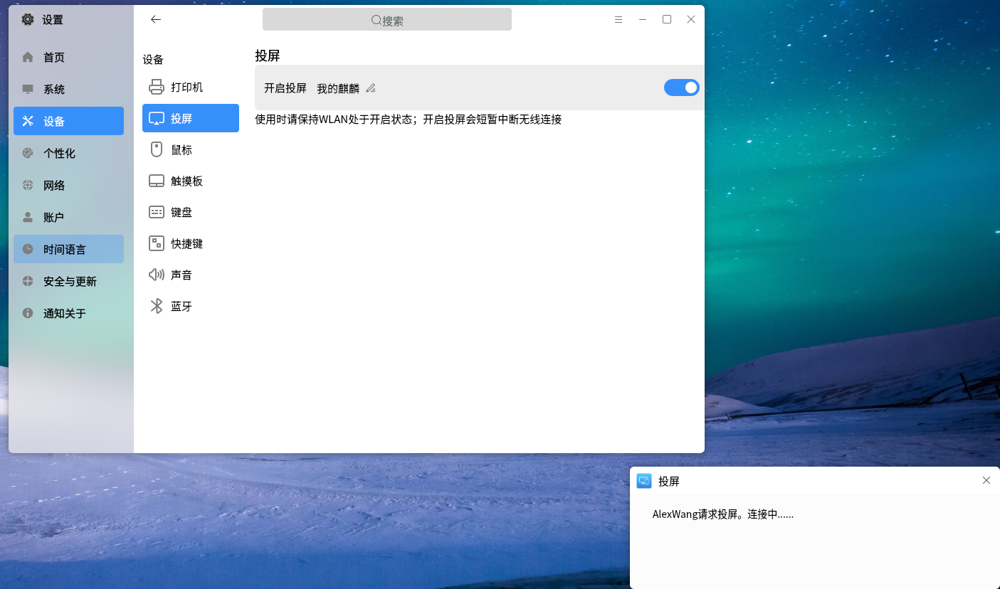

如成功连接，会在接收端同步镜像出手机端的屏幕，双击屏幕可退出全屏
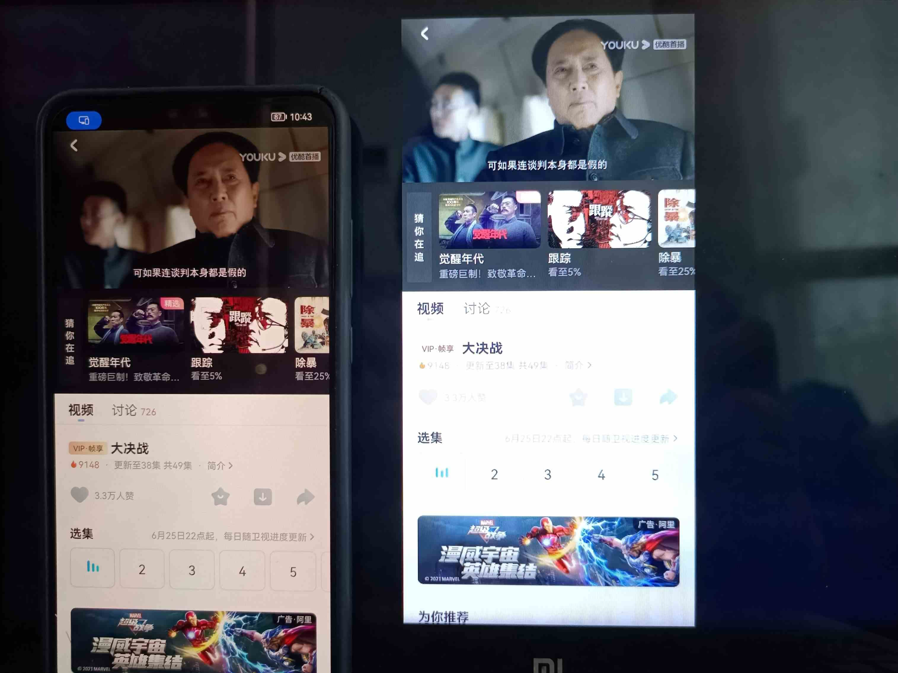

如需关闭投屏，可双击屏幕进入窗口化，点击右上角的“X”进行关闭，也可以在手机下拉菜单中，将无线投屏置灰（关闭），即可退出无线投屏
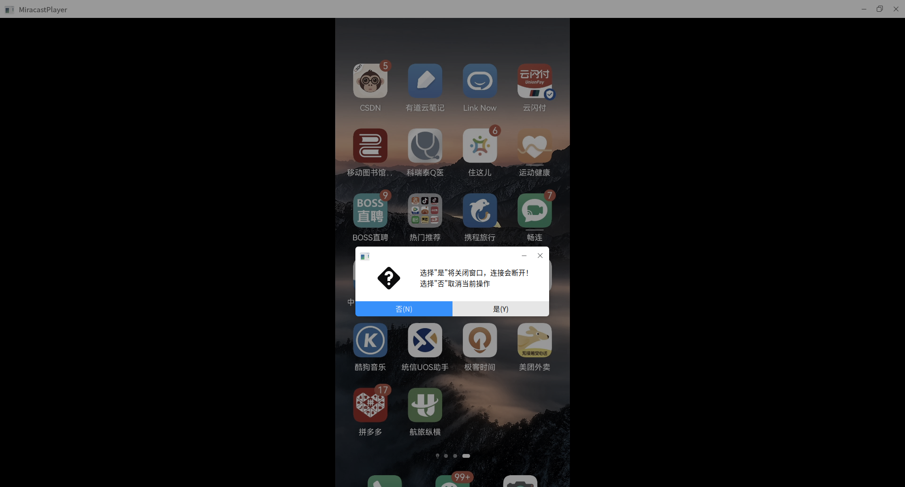
**FAQ**

1.如未成功投屏，可重新尝试连接，通常情况下手机连接一次即可被信任，下次连接无需输入PIN码（也取决于手机设计，有的手机支持授信后，无认证连接）

2.在投屏界面可以更改接收设备的名称，点击开启投屏右侧的“笔”图标，即可进入修改界面

3.当未插入无线网卡，或无线网卡不支持建立投屏所需的连接时，需要插入网卡或者对已插入网卡进行更换处理

4.当后台服务异常后，会有如下提示，可以尝试重启系统解决此问题
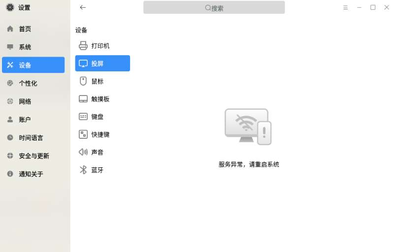

5.当未安装无线投屏的包或包版本过低时，在控制面板中不会显示投屏功能
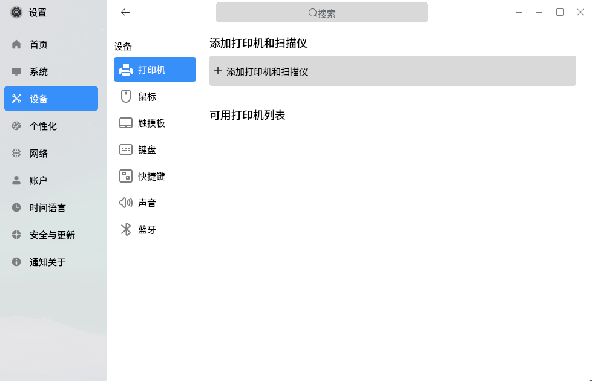

### 触摸板
触摸板提供了以下功能设置

1）连接鼠标或无线触控板时触摸板开启/关闭

2）打字时触摸板开启/关闭

3）触摸板鼠标点击开启/关闭

4）触摸滚动方式(禁用滚动,垂直滚动,水平边界滚动,垂直双指滚动,水平双指滚动)

### 鼠 标
对鼠标键、鼠标指针、光标进行个性化设置。

1）鼠标键：

- 习惯用手设置（左手/右手）

- 滚轮速度设置

- 双击间隔时长

2）指针：

- 指针移动速度

- 加速开关

- 按Ctrl键显示位置开关

- 指针大小设置（小，中，大）

3）光标：

- 文本区域光标闪烁开关

- 光标速度

### 键 盘
对键盘进行常规通用设置，并能够根据键盘语言调整键盘布局。

1）启用按键重复设置：按下某个按键不放，系统会将该行为作为重复的键盘输入。启用按键重复设置后，可对延时、速度两个选项进行设置。

- 延时：按下按键后，到系统开始接收键盘输入之间的间隔

- 速度：按下按键后，重复输入之间的间隔；间隔越长，同样时间内，重复输入的次数越少

2）键盘布局：设置当前系统的键盘布局，最多可以添加4个键盘布局。

### 快捷键
查看所有快捷键，添加或删除自定义快捷键。

Tips：系统快捷键不允许修改。

点击“添加自定义快捷键”，弹出添加窗口。

1）确认添加后，该快捷键的按键会显示“无效”；

2）点击“无”，并按下自定义的按键组合，若快捷键未被占用，则自动写入；

3）鼠标悬浮在该快捷键上时，会出现删除按钮，若不再需要该快捷键，可点击删除。

### 声 音
对输入、输出和系统音效进行设置，如图所示。

- 主音量大小：调节当前的输出音量，通过移动滑动条来控制系统输出音量大小

- 选择输出设备：输出设备是获取声卡选择的输出配置文件生成的，可以点击下拉框查看当前系统可用的输出设备，可根据需要切换的对应的输出设备

- 声卡：获取当前系统的声卡

- 连接器：列出当前输出设备的输出端口，一般有扬声器，模拟耳机，多声道输出等（检测到输出设备有对应的输出端口才会显示）

- 配置：获取当前声卡的可用的配置文件，切换声卡可用获取到另一个声卡的配置文件，切换配置相当于设置可用的输入输出设备

- 声道平衡：调节输出音量的左右声道

- 选择输入设备：输入设备是获取声卡选择的输入配置文件生成的，可以点击下拉框查看当前系统可用的输入设备，可根据需要切换的对应的输入设备（输入设备主要用来录音视频以及通话）

- 音量大小：调节当前的输入音量，通过移动滑动条来控制系统输入音量大小

- 输入等级：检测当前输入设备的输入等级（检测到有可用的输入设备时开始检测输入等级）

- 开关机音乐：控制系统开关机时是否播放开关机音乐

- 报警音量：控制终端提示音，调节声音等的提示音大小

- 系统音效主题：系统的声音主题

- 提示音量大小：提示音大小即系统发出的提示声音大小，除了受系统音量控制之外还可以通过该选项来调节

### 蓝牙

蓝牙模块提供了开关蓝牙、修改蓝牙名称、显示隐藏蓝牙任务图标、发现周围蓝牙设备、本机设备的可见性；与发现的蓝牙设备配对、连接、断开、移除蓝牙设备的基本功能，如图所示。

- 开关蓝牙：点击开启蓝牙按钮，对本机的蓝牙适配器开启和关闭

- 修改蓝牙名称：将鼠标在“可以被发现为xxx”上双击，在输入框输入想要的名称

- 显示隐藏蓝牙任务栏图标：点击按钮，可以在任务上显示或者不显示托盘上的蓝牙图标

- 发现周围蓝牙设备：首次进入蓝牙模块后，会进行周围蓝牙设备的扫描，结束后点击刷新，再次进行扫描

- 发现的蓝牙设备基础操作：鼠标悬浮到发现的设备上，出现连接按钮，点击连接按钮与设备配对并连接；设备连接后，出现在我的设备一栏；这时鼠标再悬浮到设备上，出现断开按钮和移除按钮，点击断开按钮与设备断开连接，点击移除按钮，移除与设备的配对

 

## 个性化
个性化设置提供了背景、主题、锁屏、字体、屏保、桌面六个模块。

### 背 景
针对桌面背景，提供两种背景形式的选择：颜色、图片。

### 主 题
主题包括主题模式、图标主题、光标主题。

- 主题模式：

- 图标主题和光标主题：

- 透明度和特效模式（部分机型不支持）：

### 锁 屏

选择在登录界面显示的背景图片。

### 字 体
对字体、大小、等宽进行常规设置。

点击“恢复默认设置”按钮将所有字体设置还原为系统默认状态。

### 屏 保
设置屏保程序、等待时间。

### 桌 面
设置锁定在开始菜单的图标。

 

## 网 络
网络主要包含了网络连接、VPN、代理、桌面共享。

### 网络连接
网络连接包括，可用网络显示(无线,有线)，开启/关闭wifi等功能，具体网络配置可参考“桌面环境”中的“网络”部分。

### VPN
打开外部VPN设置程序

### 代理
自动代理开启/关闭，手动代理设置(包括HTTP, HTTPS, FTP,SOCKS代理)

### 桌面共享(部分机型不支持)
勾选“允许其他人查看您的桌面”后，可设置访问时需要确认，或者要求输入指定密码。

 

## 账 户
对系统用户进行管理配置，允许管理员创建用户、删除用户、修改用户信息。

### 当前用户
#### 更改用户头像
点击用户头像，即可进行修改，图片可从本机图片中选择。

#### 更改密码
点击“更改密码”，即可修改当前用户的密码。

#### 更改账户类型
系统用户类型分两种：标准用户和管理员用户。

- 管理员用户：输入用户密码，可以临时提升root权限

- 标准用户：无法提升权限

Tips：系统至少需要存在一个管理员用户。

### 其他用户
可编辑其他用户信息，添加新用户，删除用户等。

- 添加新用户：输入用户名、密码，并选择用户类型，如图所示

- 编辑用户

 

## 云账户
云账户可用于同步设置配置选项，需要注册登录生效。

### 登录方式
- 通过麒麟ID登录中心登录，使用云账户只需拥有麒麟ID即可。

### 可同步项
- 桌面背景：同步桌面背景
- 屏保：同步屏保壁纸、屏保休眠时间等
- 字体：同步设置字体设置
- 头像：同步系统用户头像
- 开始菜单：开始菜单的相关设置
- 任务栏： 同步任务栏位置、大小等
- 快速启动项：同步任务栏插件快速启动栏相关设置
- 主题：同步设置主题设置
- 鼠标：同步设置鼠标设置
- 触摸板：如果有触摸板的话，同步设置触摸板界面
- 键盘：同步设置键盘设置
- 快捷键：同步设置自定义快捷键
- 语言和地区：同步语言以及地区时区，并非一一对应设置
- 时间和日期：同步时间，并非一一对应设置
- 默认打开方式：同步设置默认应用相关设置
- 侧边栏：同步设置通知页面相关设置
- 登录选项：同步设置用户信息自动登录以及免密登录
- 电源：同步设置电源相关选项
- 文本编辑器：同步文本编辑器Pluma的设置，需要关闭所有Pluma进程并重新打开文本编辑器才能看到效果
- 终端：同步终端设置资料卡，需要关闭所有终端实例再打开终端才能看到效果
- 天气：同步天气设置
- 文件管理器：同步文件管理器的设置，不包括置顶窗口设置
- 开机启动项：同步设置开机启动设置
- 影音：同步影音相关设置

### 使用须知
- 使用麒麟ID登录云账户，首次打开默认会同步一次，如果云端有配置文件，则会先把云端配置下载下来同步到本地，否则把本地账户配置上传到云端。
- 登录云账户之后，如果打开了自动同步按钮，用户无需其他操作，云账户每隔5分钟会同步一次本地配置到云端，上传的配置可供跨机器，跨用户同步。
- 单独的同步开关关闭会导致此项停止上传到云端，如果开启，则会将之前的此项的云端配置同步到本地。
- 如果关闭自动同步按钮，所有云端配置将会保留在关闭同步前最后一次上传到云端的本地配置。
- 如果开启自动同步按钮，则将云端配置下载下来并同步到本地。
- 单独的开关类似自动同步按钮效果，只是同步效果范围变成了当前项的同步效果。

## 时间和日期
主界面如图所示：

- 同步系统时间：与互联网上的NTP服务器时间同步

- 手动更改时间：手动设置时间和年月日

- 时间格式分12小时和24小时，点击右侧开关立即生效

- 更改时区：如图所示，根据个人需求进行选择

### 语言和地区
主界面如图所示:

- 更改数据格式：自定义日历、一周第一天、日期、时间

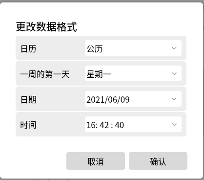

- 首选语言：系统窗口、菜单及网页的显示语言，首选推荐语言为简体中文

- 点击“添加首选语言”，可添加其他地区语言作为备选

 

## 更 新
### 安全中心
提供了安全中心的入口。

### 备 份
- 开始备份：将文件备份到其他驱动器

- 开始还原：查看备份列表，并选择还原点进行恢复

### 更 新

设置的更新模块可以检测检测系统是否有可用更新，更新模块主界面有系统状态、更新列表、更新设置三部分组成。
 

- 系统状态：主要显示当前系统更新状态以及上次检测更新时间；

- 更新列表：推送系统可用更新；

- 更新设置：设置是否允许推送可更新的应用以及是否在全部更新之前自动备份。
 

 

更新完成后，可在更新历史中查看更新情况。

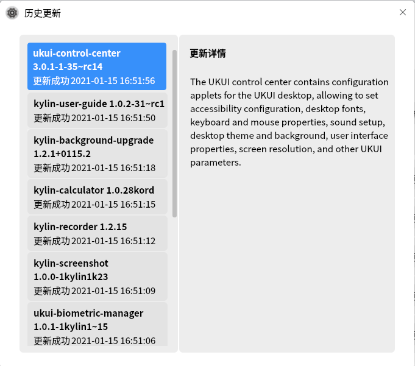

### 后台更新

后台更新主要是在后台进行重要更新操作，以及提醒用户可用更新内容。
 

- 当有重要更新时，会在后台静默更新，在升级前后用户都会收到通知信息。

- 当有可用更新时，弹出选择界面供用户选择。

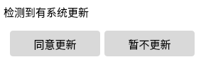

- 当用户选择立即更新后，会弹出设置>更新界面，进行检查更新

- 当用户选择推迟时，记录设定推迟时间，退出后台更新程序

## 和操作
### 通 知
用户可在此对部分应用进行是否接受通知的设置，如图所示：

### 搜 索

通过设置提高搜索效率。

### 关 于

显示本机系统的版本、设备规格、授权激活信息。

 

## 常见问题
#### 点击开始菜单上的设置按钮，无反应
在键盘上按下 Ctrl + Alt + T 组合键打开命令行终端，输入“ukui-control-center”后按下Enter，查看错误输出。

#### 修改控件状态后，控件立刻还原到修改前状态
大概率是因为权限问题。

在键盘上按下 Ctrl + Alt + T 组合键打开命令行终端，输入“rm ~/.config/dconf/user”后按下Enter。