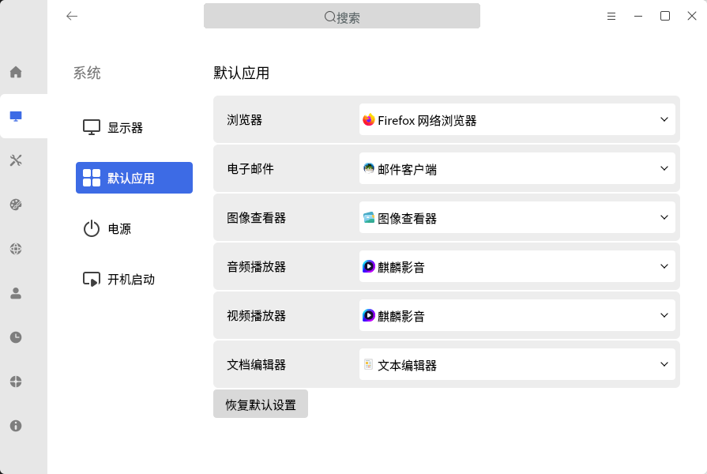
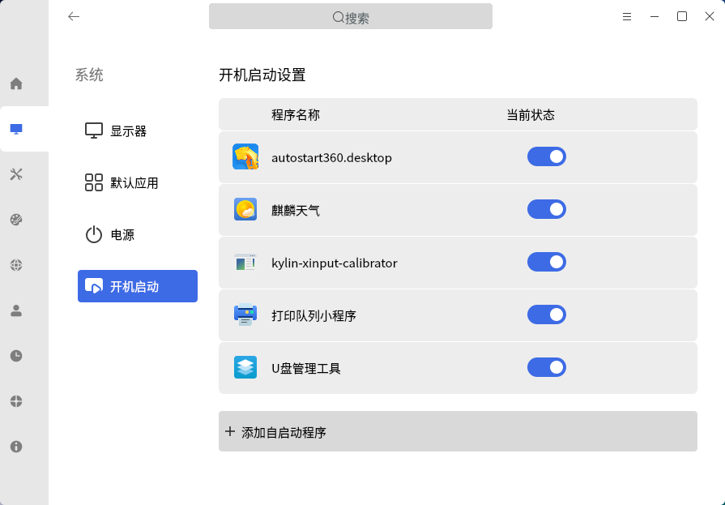
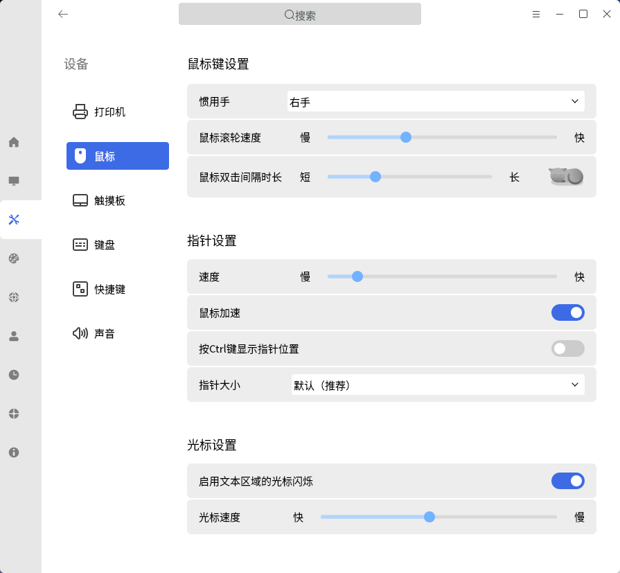
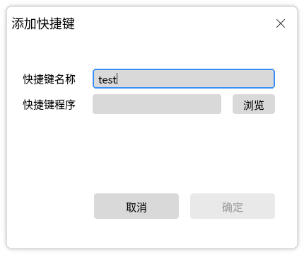
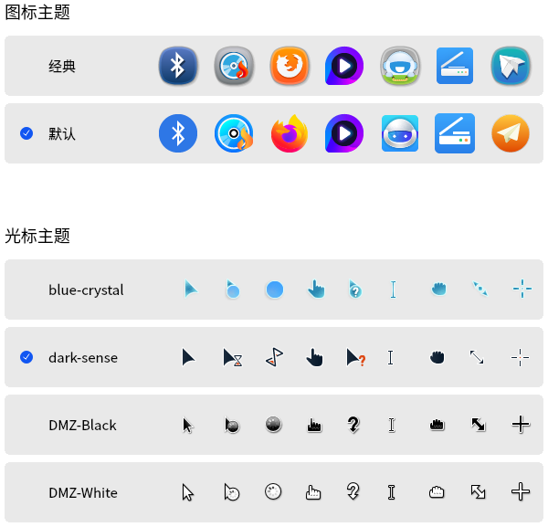
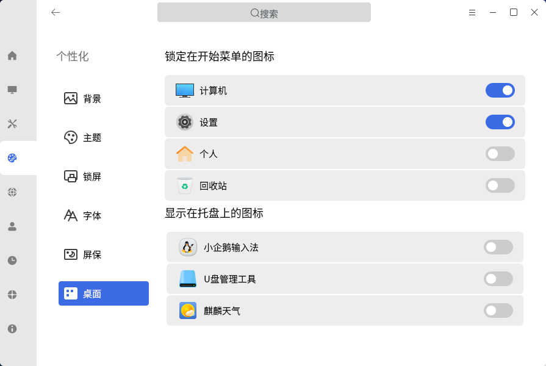
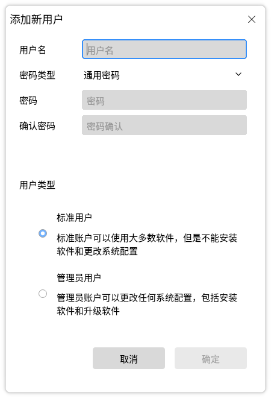
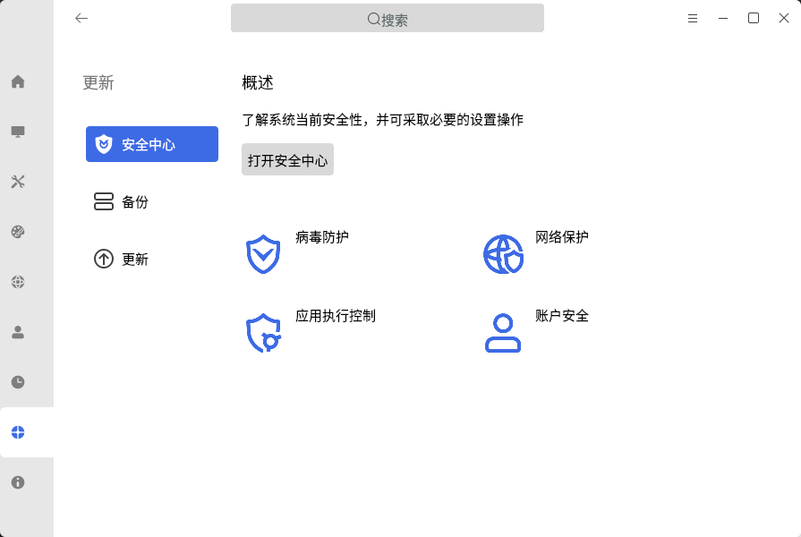
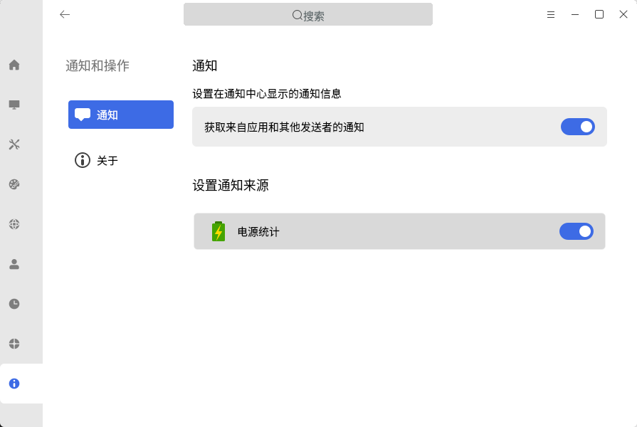
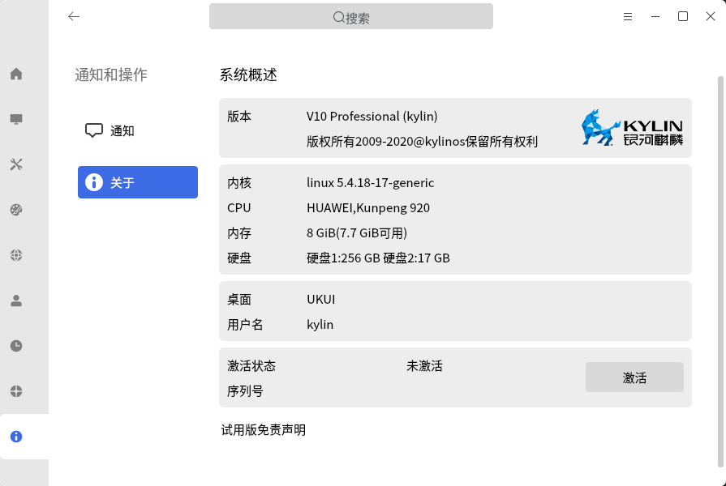

# 控制面板
## 概 述
控制面板提供了一个友好的图形用户界面，用于对操作系统常用配置项进行管理。主界面如图1所示。

 

## 系 统
系统配置设置提供了显示器、默认应用、电源、开机启动四个模块。

### 显示器
显示器可以配置显示相关的设置，上方彩色矩形代表当前屏幕，中间显示了显示器名称及接口名，如图2所示。

- 显示器：选择当前显示器

- 分辨率、方向、刷新率、缩放屏幕的修改都是针对当前活动显示器

- 屏幕缩放为全局缩放

- 夜间模式具有调整色温度、夜间模式自定义时间段打开/关闭

### 默认应用
默认应用可以修改图3中几种类型的默认打开应用：

### 电 源
- 提供平衡、节能、自定义模式可选

- 在通用设置中可以设置电源图标显示或者隐藏

- 在“自定义”模式下，用户可设置系统在空闲多少时间后，挂起和关闭显示器

### 开机启动
列表中显示当前系统已存在的开机启动软件。

点击“添加自启动程序”，可添加开机启动应用。

1）填写“程序名”；

2）填写“程序路径”，或者通过点击“浏览”按钮，在弹出的文件选择界面，选择以desktop为后缀的文件；

3）“程序描述”作为可选项，可填可不填；

4）点击“确定”按钮，新的启动项被创建并显示在列表中。

 

## 设 备
设备设置提供了打印机、鼠标、触摸板、键盘、快捷键、声音六个设置模块。

### 鼠 标
对鼠标键、鼠标指针、光标进行个性化设置。

1）鼠标键：

- 习惯用手设置（左手/右手）

- 滚轮速度设置

- 双击间隔时长

2）指针：

- 指针移动速度

- 加速开关

- 按Ctrl键显示位置开关

- 指针大小设置（小，中，大）

3）光标：

- 文本区域光标闪烁开关

- 光标速度

### 键 盘
对键盘进行常规通用设置，并能够根据键盘语言调整键盘布局。

1）启用按键重复设置：按下某个按键不放，系统会将该行为作为重复的键盘输入。启用按键重复设置后，可对延时、速度两个选项进行设置。

- 延时：按下按键后，到系统开始接收键盘输入之间的间隔

- 速度：按下按键后，重复输入之间的间隔；间隔越长，同样时间内，重复输入的次数越少

2）键盘布局：设置当前系统的键盘布局，最多可以添加4个键盘布局。

### 快捷键
查看所有快捷键，添加或删除自定义快捷键。

Tips：系统快捷键不允许修改。

点击“添加自定义快捷键”，弹出添加窗口。

1）确认添加后，该快捷键的按键会显示“disable”；

2）点击“disable”，并按下自定义的按键组合，若快捷键未被占用，则自动写入；

3）鼠标悬浮在该快捷键上时，会出现删除按钮，若不再需要该快捷键，可点击删除。

### 声 音
对输入、输出和系统音效进行设置，如图11所示。

- 主音量大小：调节当前的输出音量，通过移动滑动条来控制系统输出音量大小

- 选择输出设备：输出设备是获取声卡选择的输出配置文件生成的，可以点击下拉框查看当前系统可用的输出设备，可根据需要切换的对应的输出设备

- 声卡：获取当前系统的声卡

- 连接器：列出当前输出设备的输出端口，一般有扬声器，模拟耳机，多声道输出等（检测到输出设备有对应的输出端口才会显示）

- 配置：获取当前声卡的可用的配置文件，切换声卡可用获取到另一个声卡的配置文件，切换配置相当于设置可用的输入输出设备

- 声道平衡：调节输出音量的左右声道

- 选择输入设备：输入设备是获取声卡选择的输入配置文件生成的，可以点击下拉框查看当前系统可用的输入设备，可根据需要切换的对应的输入设备（输入设备主要用来录音视频以及通话）

- 音量大小：调节当前的输入音量，通过移动滑动条来控制系统输入音量大小

- 输入等级：检测当前输入设备的输入等级（检测到有可用的输入设备时开始检测输入等级）

- 开关机音乐：控制系统开关机时是否播放开关机音乐

- 报警音量：控制终端提示音，调节声音等的提示音大小

- 系统音效主题：系统的声音主题

- 提示音量大小：提示音大小即系统发出的提示声音大小，除了受系统音量控制之外还可以通过该选项来调节

### 蓝牙

蓝牙模块提供了开关蓝牙、修改蓝牙名称、显示隐藏蓝牙任务图标、发现周围蓝牙设备；与发现的蓝牙设备配对、连接、断开、移除蓝牙设备的基本功能，如图12所示。

- 开关蓝牙：点击开启蓝牙按钮，对本机的蓝牙适配器开启和关闭

- 修改蓝牙名称：将鼠标在“可以被发现为xxx”上双击，在输入框输入想要的名称

- 显示隐藏蓝牙任务栏图标：点击按钮，可以在任务上显示或者不显示托盘上的蓝牙图标

- 发现周围蓝牙设备：首次进入蓝牙模块后，会进行周围蓝牙设备的扫描，结束后点击刷新，再次进行扫描

- 发现的蓝牙涉笔基础操作：鼠标悬浮到发现的设备上，出现配对按钮，点击配对按钮与设备配对；点击移除按钮，移除设备；设备配对后会自己连接，出现在我的设备一栏，这时鼠标再悬浮到设备上，出现断开按钮，点击断开按钮与设备断开连接

 

## 个性化
个性化设置提供了背景、主题、锁屏、字体、屏保、桌面六个模块。

### 背 景
针对桌面背景，提供两种背景形式的选择：颜色、图片。

### 主 题
主题包括主题模式、图标主题、光标主题。

- 主题模式：

- 图标主题和光标主题：

- 透明度和特效模式（部分机型不支持）：

### 锁 屏

选择在登录界面显示的背景图片。

### 字 体
对字体、大小、等宽进行常规设置。

点击“恢复默认设置”按钮将所有字体设置还原为系统默认状态。

### 屏 保
设置屏保程序、等待时间。

### 桌 面
设置锁定在开始菜单和托盘上的图标。

 

## 网 络
网络主要包含了网络连接、VPN、代理、桌面共享。

具体网络配置可参考“桌面环境”中的“网络”部分。

### 桌面共享
勾选“允许其他人查看您的桌面”后，可设置访问时需要确认，或者要求输入指定密码。

 

## 账 户
对系统用户进行管理配置，允许管理员创建用户、删除用户、修改用户信息。

### 当前用户
#### 更改用户头像
点击用户头像，即可进行修改，图片可从本机图片中选择。

#### 更改密码
点击“更改密码”，即可修改当前用户的密码。

#### 更改账户类型
系统用户类型分两种：标准用户和管理员用户。

- 管理员用户：输入用户密码，可以临时提升root权限

- 标准用户：无法提升权限

Tips：系统至少需要存在一个管理员用户。

### 其他用户
可编辑其他用户信息，添加新用户，删除用户等。

- 添加新用户：输入用户名、密码，并选择用户类型，如图26所示

- 编辑用户

 

## 云账户
云账户可用于同步控制面板配置选项，需要注册登录生效。

## 时间和日期
主界面如图29所示：

- 同步系统时间：与互联网上的NTP服务器时间同步

- 手动更改时间：手动设置时间和年月日

- 时间格式分12小时和24小时，点击右侧开关立即生效

- 更改时区：如图31所示，根据个人需求进行选择

### 语言和地区
主界面如图32所示:

- 更改数据格式：自定义日历、一周第一天、日期、时间

- 首选语言：系统窗口、菜单及网页的显示语言，首选推荐语言为简体中文

- 点击“添加首选语言”，可添加其他地区语言作为备选

 

## 更 新
### 安全中心
提供了安全中心的入口。

### 备 份
- 开始备份：将文件备份到其他驱动器

- 开始还原：查看备份列表，并选择还原点进行恢复

### 更 新
检测系统是否有可用更新。

 

## 通知和操作
### 通 知
如图37所示：

### 关 于
显示本机系统的版本、设备规格、授权激活信息。

 

## 常见问题
### 点击开始菜单上的控制面板按钮，无反应
在键盘上按下 Ctrl + Alt + T 组合键打开命令行终端，输入“ukui-control-center”后按下Enter，查看错误输出。

### 修改控件状态后，控件立刻还原到修改前状态
大概率是因为权限问题。

在键盘上按下 Ctrl + Alt + T 组合键打开命令行终端，输入“rm ~/.config/dconf/user”后按下Enter。

